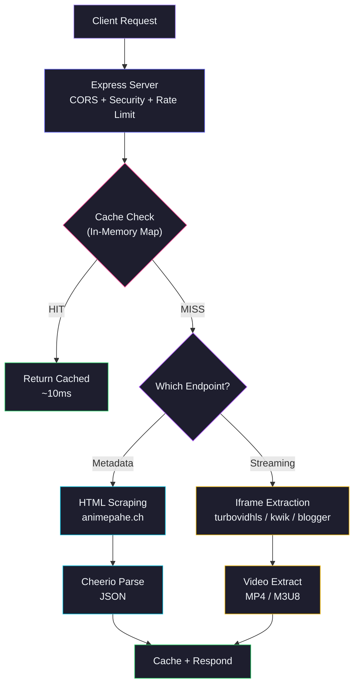
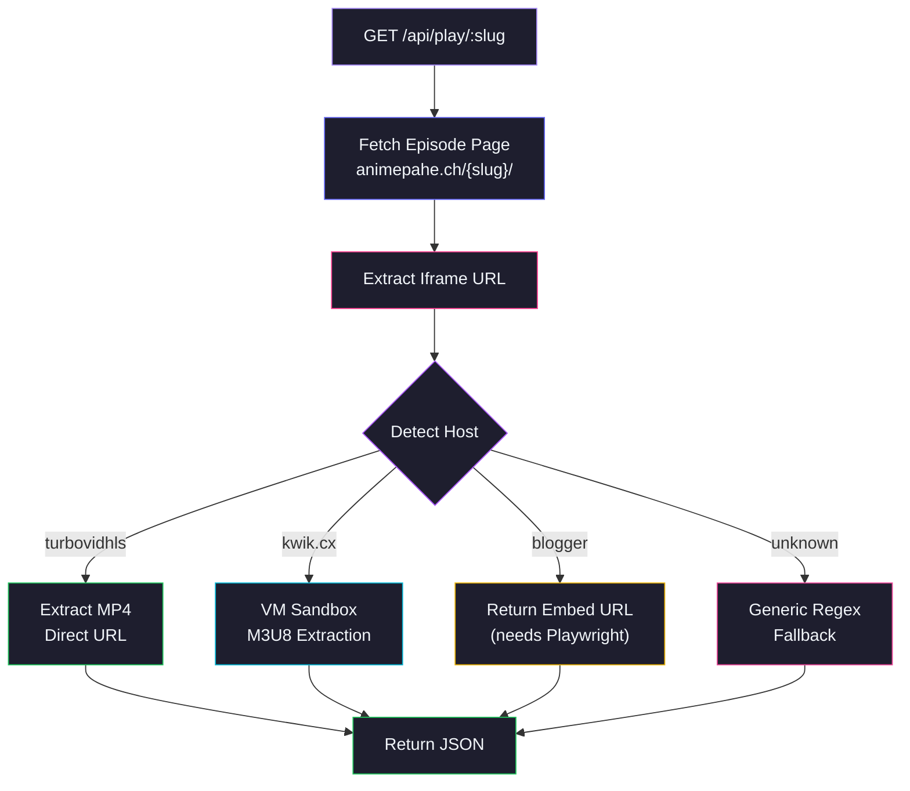
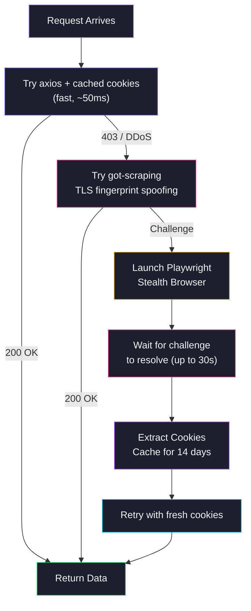

<div align="center">


</div>

<p align="center">
  <a href="https://github.com/Shineii86/AnimePaheAPI/stargazers"></a>
  <a href="https://github.com/Shineii86/AnimePaheAPI/network/members"></a>
  <a href="https://github.com/Shineii86/AnimePaheAPI/issues"></a>
  <a href="https://github.com/Shineii86/AnimePaheAPI/pulls"></a>
  <a href="https://github.com/Shineii86/AnimePaheAPI/commits"></a>
  <a href="https://github.com/Shineii86/AnimePaheAPI/blob/main/LICENSE"></a>
</p>

<p align="center">
  
  
  
  
  
  
  
  
</p>

<p align="center">
  <b>A complete RESTful API for anime streaming data scraped from animepahe.ch</b><br/>
  Search, browse, watch — every endpoint returns fresh data with smart caching.<br/>
  18+ endpoints, streaming MP4/M3U8 URLs, DDoS-Guard bypass, and auto cookie management.
</p>

<p align="center">
  <a href="#-table-of-contents">Table of Contents</a> &bull;
  <a href="#-features">Features</a> &bull;
  <a href="#-api-endpoints">API Docs</a> &bull;
  <a href="#-quick-start">Quick Start</a> &bull;
  <a href="#-deployment">Deployment</a> &bull;
  <a href="#-contributing">Contributing</a>
</p>

---

> [!WARNING]
> 1. This `API` does not store any files — it only links to media hosted on 3rd party services.
> 2. This `API` is explicitly made for **educational purposes only** and not for commercial usage. This repo will not be responsible for any misuse of it.
> 3. All anime data, images, and content belong to their respective owners (animepahe.ch). This project is not affiliated with animepahe.

---

## Table of Contents

- [Overview](#-overview)
- [Features](#-features)
- [Tech Stack](#-tech-stack)
- [Architecture](#-architecture)
- [Project Structure](#-project-structure)
- [Quick Start](#-quick-start)
- [Configuration](#-configuration)
- [API Endpoints](#-api-endpoints)
- [Streaming Flow](#-streaming-flow)
- [API Response Schema](#-api-response-schema)
- [Deployment](#-deployment)
- [Performance](#-performance)
- [Changelog Highlights](#-changelog-highlights)
- [Troubleshooting](#-troubleshooting)
- [FAQ](#-faq)
- [Roadmap](#-roadmap)
- [Contributing](#-contributing)
- [Acknowledgements](#-acknowledgements)
- [License](#-license)
- [Author](#-author)

---

## Overview

**AnimePaheAPI** is a backend service that scrapes **animepahe.ch** and provides a clean, structured JSON API for frontend applications. It handles DDoS-Guard bypass, HTML parsing, caching, and rate limiting — so your frontend only needs simple GET requests.

> No database, no auth, no complex setup. Just deploy and you have a production API.

### Why AnimePaheAPI?

- **18+ API endpoints** — Complete anime data coverage
- **Streaming URLs** — MP4 and M3U8 streaming sources extracted from iframes
- **Automatic DDoS bypass** — Cookie management via Playwright browser
- **Multi-strategy HTTP** — got-scraping + axios + Playwright fallback
- **HTML scraping fallback** — Works even when API endpoints are blocked
- **Smart caching** — In-memory cache with per-endpoint TTL
- **Deploy anywhere** — Vercel, Render, Railway, Docker, or standalone

### How It Works



---

## Features

<table>
  <tr>
    <td>

### Core
- **18+ RESTful endpoints**
- **Smart caching** with configurable TTL
- **Gzip compression** — 30-70% smaller responses
- **Request logging** — method, path, status, duration
- **Graceful error handling** per endpoint
- **Rate limiting** (100 req/min per IP)
- **CORS enabled** — works from any frontend

    </td>
    <td>

### Data
- **Full-text search** with pagination
- **Autocomplete suggestions** for search
- **Browse** by genre, studio, tag, category
- **A-Z listing** and seasonal anime
- **Anime details** with metadata
- **Episode lists** with episode numbers
- **Series catalog** browsing

    </td>
  </tr>
  <tr>
    <td>

### Streaming
- **MP4 direct links** from turbovidhls
- **M3U8 HLS streams** from kwik.cx
- **Blogger embed URLs** for playback
- **Generic fallback** extraction
- **VM sandbox** for JS-heavy iframes
- **Auto host detection** per episode

    </td>
    <td>

### Reliability
- **DDoS-Guard bypass** via Playwright
- **Cookie caching** for 14 days
- **Multi-strategy HTTP client**
- **HTML scraping fallback**
- **Auto retry on 403**
- **Stealth browser mode**
- **Zero database** — pure API + cache

    </td>
  </tr>
</table>

### Feature Highlights

| Feature | Description | Status |
|:---|:---|:---:|
| 18+ API Endpoints | Complete anime data coverage | Done |
| Full-Text Search | Keyword search with pagination | Done |
| Search Suggestions | Fast autocomplete | Done |
| Anime Info | Detailed metadata extraction | Done |
| Episode Lists | Full episode catalog per anime | Done |
| Streaming URLs | MP4 and M3U8 video sources | Done |
| Browse Endpoints | Genre, studio, tag, category, A-Z | Done |
| Seasonal Anime | Browse by season | Done |
| Smart Caching | In-memory Map with TTL | Done |
| DDoS Bypass | Playwright cookie management | Done |
| Docker Support | Containerized deployment | Done |
| Vercel Deploy | One-click serverless | Done |

---

## Tech Stack

| Technology | Purpose | Version | Documentation |
|:---|:---|:---|:---|
| Node.js | JavaScript runtime | >= 18 | [Docs](https://nodejs.org/docs/) |
| Express | HTTP server framework | 4.21 | [Docs](https://expressjs.com/en/4x/api.html) |
| Axios | HTTP client | 1.8 | [Docs](https://axios-http.com/docs/intro) |
| got-scraping | Anti-bot HTTP client | 4.2 | [Docs](https://github.com/nicandris/got-scraping) |
| Cheerio | HTML parser | 1.0 | [Docs](https://cheerio.js.org/) |
| Playwright | Browser automation | 1.52 | [Docs](https://playwright.dev/) |
| jsdom | DOM simulation | 22.1 | [Docs](https://github.com/jsdom/jsdom) |
| compression | Gzip middleware | 1.7 | [Docs](https://github.com/expressjs/compression) |
| cors | CORS middleware | 2.8 | [Docs](https://github.com/expressjs/cors) |
| dotenv | Environment config | 16.4 | [Docs](https://github.com/motdotla/dotenv) |

---

## Architecture

### Request Flow

| Stage | Component | Description |
|:-----:|-----------|-------------|
| 1 | **Client** | Browser, app, or `curl` sends request |
| 2 | **Express Server** | Routes request, applies CORS + security headers + rate limiting |
| 3 | **Cache Check** | In-memory Map with TTL — hit = instant response |
| 4 | **Fetch Data** | HTML scraping or iframe extraction from animepahe.ch |
| 5 | **Parse** | Cheerio extracts structured data from DOM |
| 6 | **Cache + Respond** | Store in cache, return JSON response |

### Streaming Architecture



### DDoS-Guard Bypass Flow



---

## Project Structure

```
AnimePaheAPI/
├── server.js                      # Express server entry point
├── package.json                   # Dependencies & scripts
├── vercel.json                    # Vercel deployment config
├── render.yaml                    # Render deployment config
├── Dockerfile                     # Docker deployment config
├── CHANGELOG.md                   # Version history
├── README.md                      # This file
│
├── public/
│   └── index.html                 # Landing page
│
└── src/
    ├── configs/
    │   ├── dataUrl.js             # URL patterns for animepahe.ch
    │   └── header.config.js       # Browser request headers
    │
    ├── extractors/
    │   ├── home.extractor.js      # Homepage data extraction
    │   ├── search.extractor.js    # Search results extraction
    │   ├── info.extractor.js      # Anime detail extraction
    │   ├── episodes.extractor.js  # Episode list extraction
    │   └── series.extractor.js    # Series/browse page extraction
    │
    ├── helper/
    │   ├── cache.helper.js        # In-memory cache with TTL
    │   └── error.helper.js        # Custom error class + handler
    │
    ├── middleware/
    │   └── creatorInfo.js         # Creator attribution middleware
    │
    ├── models/
    │   └── playModel.js           # Streaming URL extraction
    │
    ├── routes/
    │   └── apiRoutes.js           # All API endpoints
    │
    ├── scrapers/
    │   └── animepahe.js           # Core scraper with cookie mgmt
    │
    └── utils/
        ├── browser.js             # Playwright launcher + stealth
        ├── config.js              # Environment config + URLs
        ├── requestManager.js      # Multi-strategy HTTP client
        ├── jsParser.js            # JavaScript variable extraction
        ├── dataProcessor.js       # API response normalization
        └── urlConverter.js        # URL conversion utilities
```

---

## Quick Start

### Prerequisites

| Requirement | Minimum | Recommended |
|:---|:---|:---|
| Node.js | 18.x | 20.x LTS |
| npm | 9.0+ | 10.x |
| OS | Windows, macOS, Linux | Any |

### Installation

```bash
# 1. Clone the repository
git clone https://github.com/Shineii86/AnimePaheAPI.git
cd AnimePaheAPI

# 2. Install dependencies
npm install

# 3. Install Chromium for Playwright (required for DDoS bypass)
npx playwright install chromium

# 4. Start the server
npm start

# Server runs at http://localhost:3000
```

### Alternative Package Managers

```bash
# Using yarn
yarn install && yarn start

# Using pnpm
pnpm install && pnpm start
```

---

## Configuration

### Environment Variables

| Variable | Default | Description |
|:---|:---|:---|
| `PORT` | `3000` | Server port |
| `BASE_URL` | `https://animepahe.ch` | animepahe domain |
| `IFRAME_BASE_URL` | `kwik.cx` | Streaming CDN domain |
| `USER_AGENT` | Chrome 131 string | Browser user agent |
| `COOKIES` | (auto-extracted) | Manual cookie override |
| `USE_PROXY` | `false` | Enable proxy rotation |
| `PROXIES` | (empty) | Comma-separated proxy URLs |
| `CHROME_HEADLESS` | `true` | Force headless Chrome |

### Cache Configuration

| Endpoint | TTL | Rationale |
|:---|:---|:---|
| Suggestions | 30s | Autocomplete needs fresh results |
| Search | 60s | Results change as new anime air |
| Episodes | 60s | New episodes drop frequently |
| Home | 120s | Balanced freshness/performance |
| Info | 300s | Anime details rarely change |
| A-Z / Season / Genre | 180s | Static catalog data |

---

## API Endpoints

### Base URL
```
http://localhost:3000/api
```

### Response Format

All endpoints return:
```json
{
  "success": true,
  "results": { ... }
}
```

---

> ## GET Home Page

```bash
GET /api
```

Returns homepage data: latest releases, trending, and popular anime.

```bash
curl http://localhost:3000/api
```

#### Sample Response

```json
{
  "success": true,
  "results": {
    "latestReleases": [
      {
        "slug": "tomb-raider-king-episode-3-english-subbed",
        "title": "Tomb Raider King Episode 3 English Subbed",
        "poster": "https://animepahe.ch/wp-content/uploads/...",
        "episode": "Ep 3",
        "type": "Anime",
        "url": "https://animepahe.ch/tomb-raider-king-episode-3-english-subbed/"
      }
    ],
    "trending": [...],
    "popular": [...]
  }
}
```

---

> ## GET Search

```bash
GET /api/search?q={query}&page={page}
```

| Parameter | Type | Required | Default | Description |
|:---:|:---:|:---:|:---:|:---|
| `q` | `string` | Yes | — | Search query |
| `page` | `number` | No | `1` | Page number |

```bash
curl "http://localhost:3000/api/search?q=naruto&page=1"
```

#### Sample Response

```json
{
  "success": true,
  "results": {
    "results": [
      {
        "slug": "naruto",
        "title": "Naruto",
        "poster": "https://animepahe.ch/wp-content/uploads/...",
        "episodes": "220",
        "type": "Anime",
        "url": "https://animepahe.ch/series/naruto/"
      }
    ],
    "totalResults": 45,
    "currentPage": 1,
    "hasNextPage": true
  }
}
```

---

> ## GET Search Suggestions

```bash
GET /api/suggestions?q={query}
```

| Parameter | Type | Required | Default | Description |
|:---:|:---:|:---:|:---:|:---|
| `q` | `string` | Yes | — | Search query (min 2 chars) |

```bash
curl "http://localhost:3000/api/suggestions?q=nar"
```

---

> ## GET Anime Info

```bash
GET /api/info/{slug}
```

| Parameter | Type | Required | Description |
|:---:|:---:|:---:|:---|
| `slug` | `string` | Yes | Anime slug |

```bash
curl http://localhost:3000/api/info/one-piece
```

#### Sample Response

```json
{
  "success": true,
  "results": {
    "title": "One Piece",
    "slug": "one-piece",
    "poster": "https://animepahe.ch/wp-content/uploads/...",
    "synopsis": "Gol D. Roger was known as the Pirate King...",
    "genres": ["Action", "Adventure", "Comedy"],
    "episodes": [...],
    "related": [...],
    "status": "Airing",
    "type": "Anime",
    "rating": "PG-13",
    "studio": "Toei Animation"
  }
}
```

---

> ## GET Episodes

```bash
GET /api/episodes/{slug}
```

| Parameter | Type | Required | Description |
|:---:|:---:|:---:|:---|
| `slug` | `string` | Yes | Anime slug |

```bash
curl http://localhost:3000/api/episodes/one-piece
```

#### Sample Response

```json
{
  "success": true,
  "results": [
    {
      "number": 1170,
      "slug": "one-piece-episode-1170-english-subbed",
      "title": "Episode 1170",
      "url": "https://animepahe.ch/one-piece-episode-1170-english-subbed/"
    }
  ]
}
```

---

> ## GET Streaming Links

```bash
GET /api/play/{slug}
```

| Parameter | Type | Required | Description |
|:---:|:---:|:---:|:---|
| `slug` | `string` | Yes | Episode slug |

```bash
curl http://localhost:3000/api/play/thunder-3-episode-3-english-subbed
```

#### Sample Response (MP4)

```json
{
  "success": true,
  "results": {
    "slug": "thunder-3-episode-3-english-subbed",
    "anime_title": "Thunder 3",
    "episode": "3",
    "sources": [
      {
        "url": "https://e57.etvp.cc/uploads/6a60f5ecd2108.mp4",
        "isM3U8": false,
        "isEmbed": false,
        "resolution": "best",
        "filename": "Thunder 3 - 3"
      }
    ]
  }
}
```

#### Sample Response (Blogger Embed)

```json
{
  "success": true,
  "results": {
    "slug": "one-piece-episode-1170-english-subbed",
    "anime_title": "One Piece",
    "episode": "1170",
    "sources": [
      {
        "url": "https://www.blogger.com/video.g?token=...",
        "isM3U8": false,
        "isEmbed": true,
        "resolution": "best",
        "note": "Blogger video requires JavaScript execution"
      }
    ]
  }
}
```

---

> ## GET Browse Endpoints

```bash
GET /api/genre/{name}
GET /api/studio/{name}
GET /api/tag/{name}
GET /api/category/{name}
GET /api/az-list
GET /api/season
GET /api/series
```

| Endpoint | Description |
|:---|:---|
| `/api/genre/action` | Browse anime by genre |
| `/api/studio/madhouse` | Browse anime by studio |
| `/api/tag/adventure` | Browse anime by tag |
| `/api/category/action` | Browse by category |
| `/api/az-list` | A-Z alphabetical listing |
| `/api/season` | Seasonal anime |
| `/api/series` | Full series catalog |

```bash
curl http://localhost:3000/api/genre/action
```

#### Sample Response

```json
{
  "success": true,
  "results": {
    "title": "Action",
    "results": [
      {
        "slug": "one-piece",
        "title": "One Piece",
        "poster": "https://animepahe.ch/wp-content/uploads/...",
        "type": "Anime",
        "url": "https://animepahe.ch/series/one-piece/"
      }
    ],
    "currentPage": 1,
    "hasNextPage": true
  }
}
```

---

> ## GET Utility Endpoints

```bash
GET /api/health
GET /api/stats
GET /api/scraper-status
GET /api/docs
```

| Endpoint | Description |
|:---|:---|
| `/api/health` | Health check with uptime |
| `/api/stats` | Cache & server statistics |
| `/api/scraper-status` | Scraper state info |
| `/api/docs` | OpenAPI documentation |

```bash
curl http://localhost:3000/api/health
```

#### Sample Response

```json
{
  "success": true,
  "results": {
    "status": "healthy",
    "uptime": "2h 15m 30s",
    "timestamp": "2026-07-23T12:00:00.000Z",
    "version": "1.0.0",
    "source": "animepahe.ch"
  }
}
```

---

## Streaming Flow

To get a stream URL, follow these steps:

```bash
# Step 1: Get episode list
curl "http://localhost:3000/api/episodes/one-piece"
# => results[0].slug = "one-piece-episode-1170-english-subbed"

# Step 2: Get streaming sources
curl "http://localhost:3000/api/play/one-piece-episode-1170-english-subbed"
# => sources[0].url = "https://...mp4" or "https://...m3u8"

# Step 3: Play in browser or video player
```

### Supported Video Hosts

| Host | Type | Extraction Method | Status |
|:---|:---|:---|:---:|
| turbovidhls / etvp | MP4 | Direct regex from iframe HTML | Working |
| kwik.cx | M3U8 | VM sandbox with mock Hls/Plyr | Working |
| blogger.com | Embed | Returns iframe URL | Partial |
| unknown | Any | Generic regex fallback | Fallback |

### HLS Player Example

```html
<script src="https://cdn.jsdelivr.net/npm/hls.js@latest"></script>
<video id="player" controls></video>
<script>
  const video = document.getElementById('player');
  const streamUrl = 'https://...m3u8'; // From /api/play response

  if (Hls.isSupported()) {
    const hls = new Hls();
    hls.loadSource(streamUrl);
    hls.attachMedia(video);
  } else if (video.canPlayType('application/vnd.apple.mpegurl')) {
    video.src = streamUrl; // Native HLS (Safari)
  }
</script>
```

---

## API Response Schema

### Success Response
```json
{
  "success": true,
  "results": { ... }
}
```

### Error Response
```json
{
  "success": false,
  "message": "Error description"
}
```

### Anime Item Object

| Field | Type | Description | Example |
|:---|:---|:---|:---|
| `slug` | `string` | URL-friendly identifier | `"one-piece"` |
| `title` | `string` | Anime title | `"One Piece"` |
| `poster` | `string` | Poster image URL | `"https://..."` |
| `type` | `string` | Anime type | `"Anime"` |
| `episodes` | `string` | Episode count | `"1170"` |
| `url` | `string` | Full URL | `"https://animepahe.ch/..."` |

### Episode Object

| Field | Type | Description | Example |
|:---|:---|:---|:---|
| `number` | `number` | Episode number | `1170` |
| `slug` | `string` | Episode slug | `"one-piece-episode-1170-..."` |
| `title` | `string` | Episode title | `"Episode 1170"` |
| `url` | `string` | Full URL | `"https://animepahe.ch/..."` |

### Source Object

| Field | Type | Description | Example |
|:---|:---|:---|:---|
| `url` | `string` | Video URL | `"https://...mp4"` |
| `isM3U8` | `boolean` | Is HLS stream | `false` |
| `isEmbed` | `boolean` | Is embed URL | `false` |
| `resolution` | `string` | Video quality | `"best"` |
| `filename` | `string` | Download filename | `"Thunder 3 - 3"` |

---

## Deployment

### Vercel (Recommended)

[](https://vercel.com/new/clone?repository-url=https://github.com/Shineii86/AnimePaheAPI)

1. Click the button above (or import manually on vercel.com)
2. Vercel auto-detects the project — no config needed
3. Your API is live!

### Render

1. Connect your GitHub repo on [render.com](https://render.com)
2. Build Command: `npm install`
3. Start Command: `npm start`

### Docker

```bash
# Build
docker build -t animepaheapi .

# Run
docker run -p 3000:3000 animepaheapi
```

### Standalone Server

```bash
# Clone and install
git clone https://github.com/Shineii86/AnimePaheAPI.git
cd AnimePaheAPI && npm install

# Start production server
npm start
# → http://localhost:3000
```

---

## Performance

| Metric | Value |
|:---|:---|
| Cold start | ~500ms |
| Warm response | ~50-200ms |
| Cache hit | ~10ms |
| Cache TTL | 30s - 5min |
| Rate limit | 100 req/min/IP |

---

## Changelog Highlights

| Version | Date | Key Changes |
|:---|:---|:---|
| **1.0.0** | 2026-07-23 | Initial release — 18+ endpoints, streaming MP4/M3U8, DDoS bypass, modular architecture |

> See [CHANGELOG.md](./CHANGELOG.md) for the full version history.

---

## Troubleshooting

| Problem | Cause | Solution |
|:---|:---|:---|
| `npm install` fails | Node.js version too old | Upgrade to Node.js 18+ |
| CORS errors | CORS not configured | CORS is enabled by default |
| 404 on API routes | Wrong URL format | Use `/api/` prefix |
| Streaming 500 | Playwright not installed | Run `npx playwright install chromium` |
| Empty episodes | DDoS-Guard blocking | Wait for cookie refresh or restart |
| Slow first request | Cookie refresh needed | Normal — subsequent requests are fast |

---

## FAQ

<details>
<summary><b>How do I search for anime?</b></summary>
<br/>
Use <code>/api/search?q=your+search</code>. Results include title, poster, episodes, and type. For autocomplete, use <code>/api/suggestions?q=your+search</code>.
</details>

<details>
<summary><b>How do I get streaming URLs?</b></summary>
<br/>
Use <code>/api/play/:slug</code> where <code>:slug</code> is the episode slug (e.g., <code>one-piece-episode-1170-english-subbed</code>). Returns MP4 or M3U8 URLs.
</details>

<details>
<summary><b>Why are some episodes returning embed URLs instead of direct links?</b></summary>
<br/>
Blogger-hosted episodes require JavaScript execution to extract the actual video URL. Without Playwright, we return the embed URL. Install Playwright for full extraction: <code>npx playwright install chromium</code>.
</details>

<details>
<summary><b>Can I use this in my frontend app?</b></summary>
<br/>
Yes! CORS is enabled for all origins. Just make fetch requests to the API endpoints.
</details>

<details>
<summary><b>How often does the data refresh?</b></summary>
<br/>
The cache TTL is 30s-5min depending on the endpoint. After that, the next request triggers a fresh fetch.
</details>

<details>
<summary><b>Can I self-host this?</b></summary>
<br/>
Yes! Use <code>npm start</code> to run the Express server on any VPS, Docker container, or PaaS.
</details>

---

## Roadmap

### Planned Features

- [ ] API key authentication — per-user rate limits
- [ ] Redis cache — persistent caching
- [ ] Webhook notifications — push new episodes
- [ ] Client SDK — NPM package for easy integration
- [ ] OpenAPI/Swagger docs — interactive API explorer

### Completed

- [x] 18+ API endpoints
- [x] Full-text search with pagination
- [x] Search suggestions
- [x] Streaming MP4/M3U8 extraction
- [x] DDoS-Guard bypass via Playwright
- [x] Multi-strategy HTTP client
- [x] Smart caching with TTL
- [x] Docker support
- [x] Vercel/Render deployment

---

## Contributing

Contributions are welcome! Please follow these steps:

1. Fork the repository
2. Create a feature branch (`git checkout -b feature/amazing-feature`)
3. Commit your changes (`git commit -m 'Add amazing feature'`)
4. Push to the branch (`git push origin feature/amazing-feature`)
5. Open a Pull Request

---

## Acknowledgements

- [animepahe.ch](https://animepahe.ch) for the source data
- [Cheerio](https://cheerio.js.org/) for HTML parsing
- [Playwright](https://playwright.dev/) for browser automation
- [Express](https://expressjs.com/) for the web framework
- [MiruroAPI](https://github.com/Shineii86/MiruroAPI) for README inspiration

---

## License

MIT License - see [LICENSE](LICENSE) file.

---

## Author

**Shinei Nouzen** - [GitHub](https://github.com/Shineii86)

<p align="center">
  
</p>
