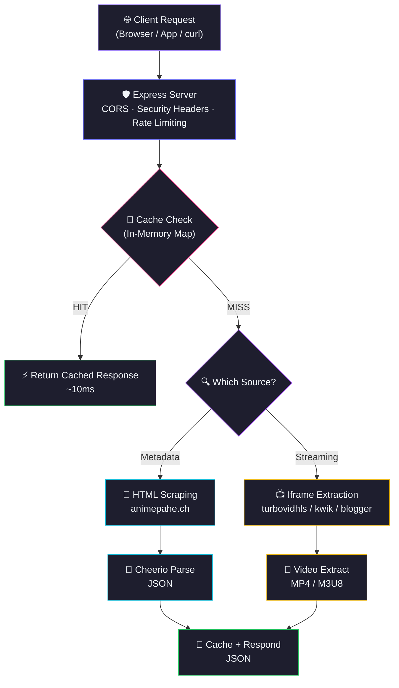
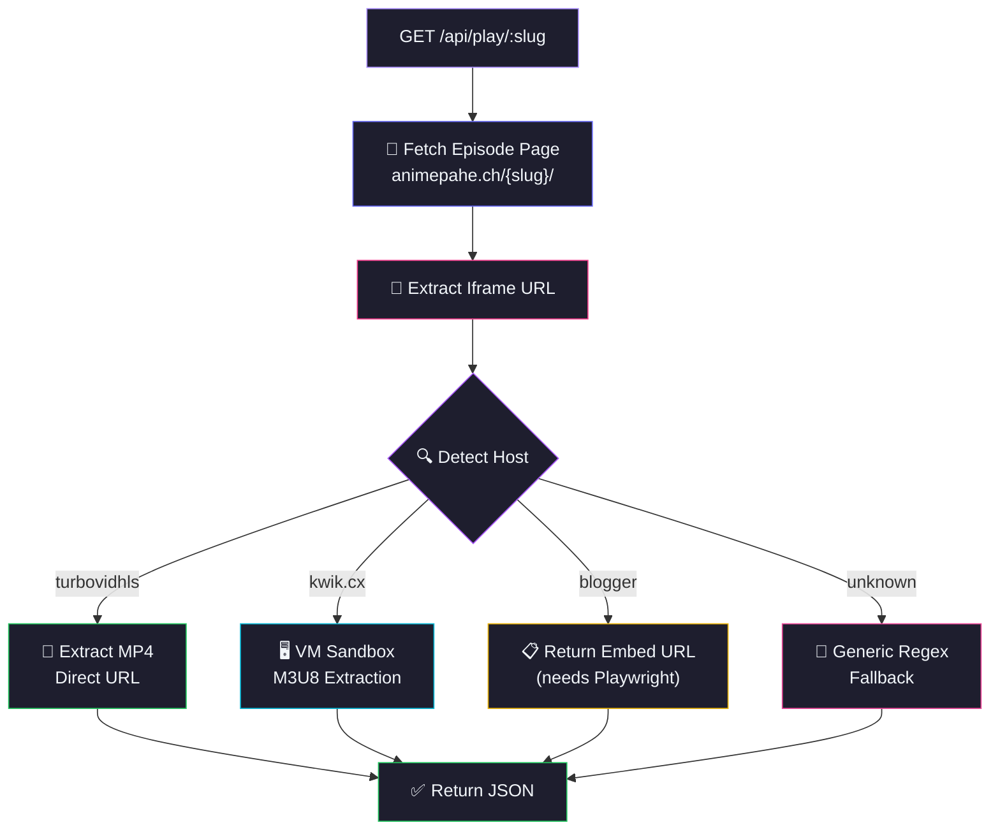
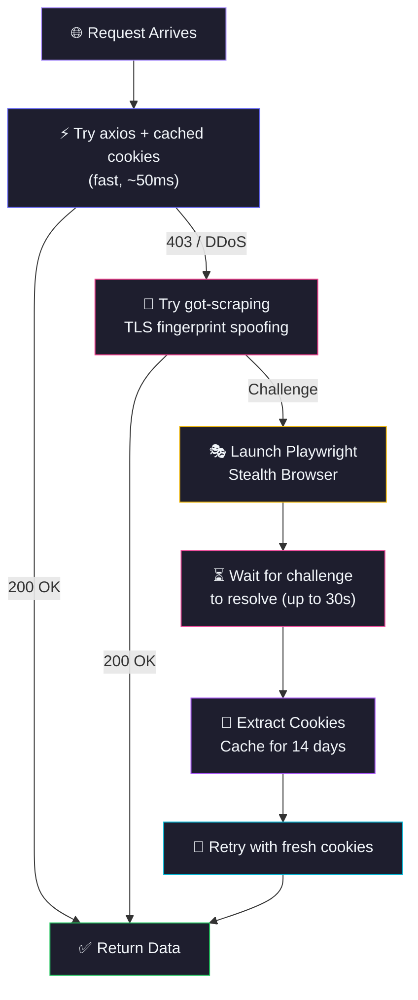
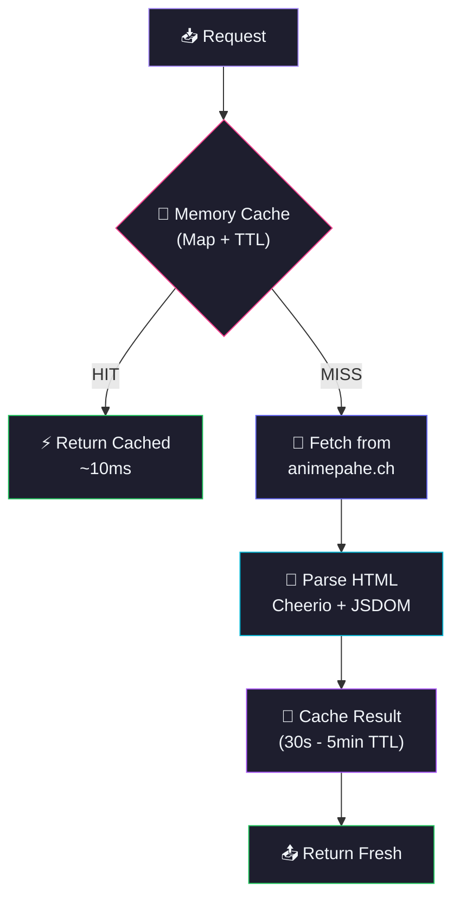

<div align="center">
  
  

</div>

<p align="center">
  <a href="https://github.com/Shineii86/AnimePaheAPI/stargazers"></a>
  <a href="https://github.com/Shineii86/AnimePaheAPI/network/members"></a>
  <a href="https://github.com/Shineii86/AnimePaheAPI/issues"></a>
  <a href="https://github.com/Shineii86/AnimePaheAPI/pulls"></a>
  <a href="https://github.com/Shineii86/AnimePaheAPI/commits"></a>
  <a href="https://github.com/Shineii86/AnimePaheAPI/blob/main/LICENSE"></a>
</p>

<p align="center">
  
  
  
  
  
  
  
  
  
</p>

<p align="center">
  <b>A complete RESTful API for anime streaming data scraped from animepahe.ch</b><br/>
  Search, browse, watch — every endpoint returns fresh data with smart caching.<br/>
  21+ endpoints, streaming MP4/M3U8 URLs, DDoS-Guard bypass, and auto cookie management.
</p>

<p align="center">
  <a href="#-table-of-contents">Table of Contents</a> &bull;
  <a href="#-features">Features</a> &bull;
  <a href="#-api-endpoints">API Docs</a> &bull;
  <a href="#-quick-start">Quick Start</a> &bull;
  <a href="#-deployment">Deployment</a> &bull;
  <a href="#-contributing">Contributing</a>
</p>

---

> [!WARNING]
> 1. This `API` does not store any files — it only links to media hosted on 3rd party services.
> 2. This `API` is explicitly made for **educational purposes only** and not for commercial usage. This repo will not be responsible for any misuse of it.
> 3. All anime data, images, and content belong to their respective owners (animepahe.ch). This project is not affiliated with animepahe.

> [!NOTE]
> IMPORTANT NOTICE: API MAYBE Temporarily Paused
> The API maybe temporarily paused due to suspiciously too many requests. My hosted version of this API is only for testing purposes. You MUST host your own instance to use the API.

---

## 📖 Table of Contents

- [Overview](#-overview)
- [Features](#-features)
- [Tech Stack](#-tech-stack)
- [Architecture](#-architecture)
- [Project Structure](#-project-structure)
- [Quick Start](#-quick-start)
- [Configuration](#-configuration)
- [API Endpoints](#-api-endpoints)
- [Streaming Flow](#-streaming-flow)
- [API Response Schema](#-api-response-schema)
- [Deployment](#-deployment)
- [Available Scripts](#-available-scripts)
- [Performance](#-performance)
- [Changelog Highlights](#-changelog-highlights)
- [Troubleshooting](#-troubleshooting)
- [FAQ](#-faq)
- [Roadmap](#-roadmap)
- [Contributing](#-contributing)
- [Acknowledgements](#-acknowledgements)
- [License](#-license)
- [Author](#-author)
- [Star History](#-star-history)

---

## 🌸 Overview

**AnimePaheAPI** is a backend service that scrapes **animepahe.ch** and provides a clean, structured JSON API for frontend applications. It handles DDoS-Guard bypass, HTML parsing, caching, and rate limiting — so your frontend only needs simple GET requests.

> 💡 No database, no auth, no complex setup. Just deploy and you have a production API.

### Why AnimePaheAPI?

- 🎬 **21+ API Endpoints** — Complete anime data coverage
- 🎥 **Streaming URLs** — MP4 and M3U8 streaming sources extracted from iframes
- 🛡️ **Automatic DDoS bypass** — Cookie management via Playwright browser
- 🌐 **Multi-strategy HTTP** — got-scraping + axios + Playwright fallback
- 🔍 **HTML scraping fallback** — Works even when API endpoints are blocked
- ⚡ **Smart caching** — In-memory cache with per-endpoint TTL
- 🚀 **Deploy anywhere** — Vercel, Render, Railway, Docker, or standalone

### How It Works



---

## ✨ Features

<table>
  <tr>
    <td>

### ⚡ Core
- **21+ RESTful endpoints**
- **Smart caching** with configurable TTL
- **Gzip compression** — 30-70% smaller responses
- **Request logging** — method, path, status, duration
- **Graceful error handling** per endpoint
- **Rate limiting** (100 req/min per IP)
- **CORS enabled** — works from any frontend

    </td>
    <td>

### 🔍 Data
- **Full-text search** with pagination
- **Autocomplete suggestions** for search
- **Browse** by genre, studio, tag, category
- **A-Z listing** and seasonal anime
- **Anime details** with metadata
- **Episode lists** with episode numbers
- **Series catalog** browsing

    </td>
  </tr>
  <tr>
    <td>

### 📡 Streaming
- **MP4 direct links** from turbovidhls
- **M3U8 HLS streams** from kwik.cx
- **Blogger embed URLs** for playback
- **Generic fallback** extraction
- **VM sandbox** for JS-heavy iframes
- **Auto host detection** per episode

    </td>
    <td>

### 🛡️ Reliability
- **DDoS-Guard bypass** via Playwright
- **Cookie caching** for 14 days
- **Multi-strategy HTTP client**
- **HTML scraping fallback**
- **Auto retry on 403**
- **Stealth browser mode**
- **Zero database** — pure API + cache

    </td>
  </tr>
</table>

### 🌟 Feature Highlights

| Feature | Description | Status |
|:---|:---|:---:|
| 🎬 21+ API Endpoints | Complete anime data coverage | ✅ |
| 🔍 Full-Text Search | Keyword search with pagination | ✅ |
| 💡 Search Suggestions | Fast autocomplete | ✅ |
| ℹ️ Anime Info | Detailed metadata extraction | ✅ |
| 📺 Episode Lists | Full episode catalog per anime | ✅ |
| 🎥 Streaming URLs | MP4 and M3U8 video sources | ✅ |
| 🏷️ Browse Endpoints | Genre, studio, tag, category, A-Z | ✅ |
| 📅 Seasonal Anime | Browse by season | ✅ |
| 🔄 Smart Caching | In-memory Map with TTL | ✅ |
| 🛡️ DDoS Bypass | Playwright cookie management | ✅ |
| 🐳 Docker Support | Containerized deployment | ✅ |
| ▲ Vercel Deploy | One-click serverless | ✅ |

---

## 🛠️ Tech Stack

| Technology | Purpose | Version | Documentation |
|:---|:---|:---|:---|
| 🟢 [Node.js](https://nodejs.org/) | JavaScript runtime | >= 20 | [Docs](https://nodejs.org/docs/) |
| ⚡ [Express](https://expressjs.com/) | HTTP server framework | 4.21 | [Docs](https://expressjs.com/en/4x/api.html) |
| 🌐 [Axios](https://axios-http.com/) | HTTP client | 1.8 | [Docs](https://axios-http.com/docs/intro) |
| 🔧 [got-scraping](https://github.com/nicandris/got-scraping) | Anti-bot HTTP client | 4.2 | [Docs](https://github.com/nicandris/got-scraping) |
| 🔎 [Cheerio](https://cheerio.js.org/) | HTML parser | 1.0 | [Docs](https://cheerio.js.org/) |
| 🎭 [Playwright](https://playwright.dev/) | Browser automation | 1.52 | [Docs](https://playwright.dev/) |
| 🌍 [jsdom](https://github.com/jsdom/jsdom) | DOM simulation | 22.1 | [Docs](https://github.com/jsdom/jsdom) |
| 📦 [compression](https://github.com/expressjs/compression) | Gzip middleware | 1.7 | [Docs](https://github.com/expressjs/compression) |
| 🔒 [cors](https://github.com/expressjs/cors) | CORS middleware | 2.8 | [Docs](https://github.com/expressjs/cors) |
| 🔧 [dotenv](https://github.com/motdotla/dotenv) | Environment config | 16.4 | [Docs](https://github.com/motdotla/dotenv) |

### 📦 Key Dependencies

```json
{
  "express": "^4.21.0",        // HTTP server
  "axios": "^1.8.0",         // HTTP client
  "cheerio": "^1.0.0",       // HTML parser
  "got-scraping": "^4.2.0",  // Anti-bot HTTP client
  "playwright": "^1.52.0",   // Browser automation
  "jsdom": "^22.1.0",        // DOM simulation
  "compression": "^1.7.0",   // Gzip middleware
  "cors": "^2.8.0",          // CORS middleware
  "dotenv": "^16.4.0"        // Environment variables
}
```

---

## 🏗️ Architecture

### Request Flow

| Stage | Component | Description |
|:-----:|-----------|-------------|
| 1 | **🌐 Client** | Browser, app, or `curl` sends request |
| 2 | **🛡️ Express Server** | Routes request, applies CORS + security headers + rate limiting |
| 3 | **💾 Cache Check** | In-memory Map with TTL — hit = instant response |
| 4 | **📡 Fetch Data** | HTML scraping or iframe extraction from animepahe.ch |
| 5 | **🔎 Parse** | Cheerio extracts structured data from DOM |
| 6 | **💾 Cache + Respond** | Store in cache, return JSON response |

### Streaming Architecture



### DDoS-Guard Bypass Flow



### Caching Architecture



> 💡 Serverless functions have read-only filesystems except `/tmp`. The cache uses in-memory `Map` which survives across warm invocations.

---

## 📁 Project Structure

```
AnimePaheAPI/
├── 📄 server.js                            # 🚀 Express server entry point
├── 📦 package.json                         # 📦 Dependencies & scripts
├── ▲ vercel.json                           # ▲ Vercel routing config
├── 📄 render.yaml                          # 🔴 Render deployment config
├── 🐳 Dockerfile                           # 🐳 Docker support
├── 📝 CHANGELOG.md                         # 📝 Version history
├── 📖 README.md                            # 📖 This file
│
├── 📂 public/                              # 🌐 Static files
│   └── 📄 index.html                       #    🌐 Landing page
│
└── 📂 src/                                 # ⚙️ Core logic
    ├── 📂 configs/                         #    ⚙️ Configuration
    │   ├── 📄 dataUrl.js                   #       🔗 URL patterns
    │   └── 📄 header.config.js             #       📋 Browser headers
    │
    ├── 📂 extractors/                      #    🔎 Data extractors
    │   ├── 📄 home.extractor.js            #       🌐 Homepage extraction
    │   ├── 📄 search.extractor.js          #       🔍 Search results
    │   ├── 📄 info.extractor.js            #       ℹ️ Anime details
    │   ├── 📄 episodes.extractor.js        #       📺 Episode lists
    │   └── 📄 series.extractor.js          #       📋 Series/browse pages
    │
    ├── 📂 helper/                          #    🛠️ Helpers
    │   ├── 📄 cache.helper.js              #       💾 In-memory cache
    │   └── 📄 error.helper.js              #       ❌ Error handler
    │
    ├── 📂 middleware/                       #    🔒 Middleware
    │   └── 📄 creatorInfo.js               #       👤 Creator attribution
    │
    ├── 📂 models/                          #    🎬 Models
    │   └── 📄 playModel.js                 #       🎥 Streaming extraction
    │
    ├── 📂 routes/                          #    🛤️ Routes
    │   └── 📄 apiRoutes.js                 #       🌐 21+ endpoints
    │
    ├── 📂 scrapers/                        #    🕷️ Scrapers
    │   └── 📄 animepahe.js                 #       🕷️ Core scraper + DDoS bypass
    │
    └── 📂 utils/                           #    🔧 Utilities
        ├── 📄 browser.js                   #       🎭 Playwright launcher
        ├── 📄 config.js                    #       ⚙️ Environment config
        ├── 📄 requestManager.js            #       🌐 Multi-strategy HTTP
        ├── 📄 jsParser.js                  #       📝 JS variable extraction
        ├── 📄 dataProcessor.js             #       📊 Response normalization
        └── 📄 urlConverter.js              #       🔗 URL conversion
```

---

## 🚀 Quick Start

### Prerequisites

| Requirement | Minimum | Recommended |
|:---|:---|:---|
| 📦 Node.js | 18.x | 20.x LTS |
| 📦 npm | 9.0+ | 10.x |
| 💻 OS | Windows, macOS, Linux | Any |

### 🔧 Installation

```bash
# 1️⃣ Clone the repository
git clone https://github.com/Shineii86/AnimePaheAPI.git
cd AnimePaheAPI

# 2️⃣ Install dependencies
npm install

# 3️⃣ Install Chromium for Playwright (required for DDoS bypass)
npx playwright install chromium

# 4️⃣ Start the server
npm start

# 🌐 Server runs at http://localhost:3000
```

> 🌐 Open [http://localhost:3000](http://localhost:3000) in your browser.

### 🐳 Alternative Package Managers

```bash
# Using yarn
yarn install
yarn start

# Using pnpm
pnpm install
pnpm start

# Using bun
bun install
bun start
```

---

## ⚙️ Configuration

### Environment Variables

| Variable | Default | Description |
|:---|:---|:---|
| `PORT` | `3000` | Server port |
| `BASE_URL` | `https://animepahe.ch` | animepahe domain |
| `IFRAME_BASE_URL` | `kwik.cx` | Streaming CDN domain |
| `USER_AGENT` | Chrome 131 string | Browser user agent |
| `COOKIES` | (auto-extracted) | Manual cookie override |
| `USE_PROXY` | `false` | Enable proxy rotation |
| `PROXIES` | (empty) | Comma-separated proxy URLs |
| `CHROME_HEADLESS` | `true` | Force headless Chrome |

### Cache Configuration

| Endpoint | TTL | Rationale |
|:---|:---|:---|
| 💡 Suggestions | 30s | Autocomplete needs fresh results |
| 🔍 Search | 60s | Results change as new anime air |
| 📺 Episodes | 60s | New episodes drop frequently |
| 🌐 Home | 120s | Balanced freshness/performance |
| ℹ️ Info | 300s | Anime details rarely change |
| 🏷️ A-Z / Season / Genre | 180s | Static catalog data |

---

## 📡 API Endpoints

### Base URL
```
http://localhost:3000/api
```

### Response Format

All endpoints return:
```json
{
  "success": true,
  "results": { ... }
}
```

### 📺 Streaming Flow

To get a stream URL, follow these 3 steps:

```bash
# Step 1: Get episode list
curl "http://localhost:3000/api/episodes/one-piece"
# => results[0].slug = "one-piece-episode-1170-english-subbed"

# Step 2: Get streaming sources
curl "http://localhost:3000/api/play/one-piece-episode-1170-english-subbed"
# => sources[0].url = "https://...mp4" or "https://...m3u8"

# Step 3: Play in browser or video player
```

### 🎥 HLS Player Example

```html
<script src="https://cdn.jsdelivr.net/npm/hls.js@latest"></script>
<video id="player" controls></video>
<script>
  const video = document.getElementById('player');
  const streamUrl = 'https://...m3u8'; // From /api/play response

  if (Hls.isSupported()) {
    const hls = new Hls();
    hls.loadSource(streamUrl);
    hls.attachMedia(video);
  } else if (video.canPlayType('application/vnd.apple.mpegurl')) {
    video.src = streamUrl; // Native HLS (Safari)
  }
</script>
```

---

> ## 🌐 GET Home Page

### Endpoint

```bash
/
```

#### Parameters

> No parameters required.

#### Example of request

```bash
curl "http://localhost:3000/api"
```

```javascript
import axios from "axios";
const resp = await axios.get("http://localhost:3000/api");
console.log(resp.data);
```

#### Sample Response

```json
{
  "success": true,
  "results": {
    "latestReleases": [
      {
        "slug": "tomb-raider-king-episode-3-english-subbed",
        "title": "Tomb Raider King Episode 3 English Subbed",
        "poster": "https://animepahe.ch/wp-content/uploads/...",
        "episode": "Ep 3",
        "type": "Anime",
        "url": "https://animepahe.ch/tomb-raider-king-episode-3-english-subbed/"
      }
    ],
    "trending": [...],
    "popular": [...]
  }
}
```

---

> ## 🔍 GET Search

### Endpoint

```bash
/search
```

#### Parameters

| Parameter | Type | Mandatory | Default | Description |
| :-------: | :--: | :-------: | :-----: | :---------: |
| `q` | `string` | Yes ✔️ | — | Search keyword |
| `page` | `number` | No | `1` | Page number |

#### Example of request

```bash
curl "http://localhost:3000/api/search?q=naruto&page=1"
```

```javascript
import axios from "axios";
const resp = await axios.get("http://localhost:3000/api/search", {
  params: { q: "naruto", page: 1 }
});
console.log(resp.data);
```

#### Sample Response

```json
{
  "success": true,
  "results": {
    "results": [
      {
        "slug": "naruto",
        "title": "Naruto",
        "poster": "https://animepahe.ch/wp-content/uploads/...",
        "episodes": "220",
        "type": "Anime",
        "url": "https://animepahe.ch/series/naruto/"
      }
    ],
    "totalResults": 45,
    "currentPage": 1,
    "hasNextPage": true
  }
}
```

---

> ## 💡 GET Search Suggestions

### Endpoint

```bash
/suggestions
```

#### Parameters

| Parameter | Type | Mandatory | Default | Description |
| :-------: | :--: | :-------: | :-----: | :---------: |
| `q` | `string` | Yes ✔️ | — | Search keyword (min 2 chars) |

#### Example of request

```bash
curl "http://localhost:3000/api/suggestions?q=nar"
```

```javascript
import axios from "axios";
const resp = await axios.get("http://localhost:3000/api/suggestions", {
  params: { q: "nar" }
});
console.log(resp.data);
```

#### Sample Response

```json
{
  "success": true,
  "results": [
    { "slug": "naruto", "title": "Naruto", "poster": "https://..." },
    { "slug": "naruto-shippuden", "title": "Naruto: Shippuden", "poster": "https://..." }
  ]
}
```

---

> ## ℹ️ GET Anime Info

### Endpoint

```bash
/info/:slug
```

#### Parameters

| Parameter | Type | Mandatory | Default | Description |
| :-------: | :--: | :-------: | :-----: | :---------: |
| `slug` | `string` | Yes ✔️ | — | Anime slug |

#### Example of request

```bash
curl "http://localhost:3000/api/info/one-piece"
```

```javascript
import axios from "axios";
const resp = await axios.get("http://localhost:3000/api/info/one-piece");
console.log(resp.data);
```

#### Sample Response

```json
{
  "success": true,
  "results": {
    "title": "One Piece",
    "slug": "one-piece",
    "poster": "https://animepahe.ch/wp-content/uploads/...",
    "synopsis": "Gol D. Roger was known as the Pirate King...",
    "genres": ["Action", "Adventure", "Comedy"],
    "episodes": [...],
    "related": [...],
    "status": "Airing",
    "type": "Anime",
    "rating": "PG-13",
    "studio": "Toei Animation"
  }
}
```

---

> ## 📺 GET Episodes

### Endpoint

```bash
/episodes/:slug
```

#### Parameters

| Parameter | Type | Mandatory | Default | Description |
| :-------: | :--: | :-------: | :-----: | :---------: |
| `slug` | `string` | Yes ✔️ | — | Anime slug |

#### Example of request

```bash
curl "http://localhost:3000/api/episodes/one-piece"
```

```javascript
import axios from "axios";
const resp = await axios.get("http://localhost:3000/api/episodes/one-piece");
console.log(resp.data);
```

#### Sample Response

```json
{
  "success": true,
  "results": [
    {
      "number": 1170,
      "slug": "one-piece-episode-1170-english-subbed",
      "title": "Episode 1170",
      "url": "https://animepahe.ch/one-piece-episode-1170-english-subbed/"
    }
  ]
}
```

---

> ## 🎥 GET Streaming Links

### Endpoint

```bash
/play/:slug
```

#### Parameters

| Parameter | Type | Mandatory | Default | Description |
| :-------: | :--: | :-------: | :-----: | :---------: |
| `slug` | `string` | Yes ✔️ | — | Episode slug |

#### Example of request

```bash
curl "http://localhost:3000/api/play/thunder-3-episode-3-english-subbed"
```

```javascript
import axios from "axios";
const resp = await axios.get("http://localhost:3000/api/play/thunder-3-episode-3-english-subbed");
console.log(resp.data);
```

#### Sample Response (MP4)

```json
{
  "success": true,
  "results": {
    "slug": "thunder-3-episode-3-english-subbed",
    "anime_title": "Thunder 3",
    "episode": "3",
    "sources": [
      {
        "url": "https://e57.etvp.cc/uploads/6a60f5ecd2108.mp4",
        "isM3U8": false,
        "isEmbed": false,
        "resolution": "best",
        "filename": "Thunder 3 - 3"
      }
    ]
  }
}
```

#### Sample Response (Blogger Embed)

```json
{
  "success": true,
  "results": {
    "slug": "one-piece-episode-1170-english-subbed",
    "anime_title": "One Piece",
    "episode": "1170",
    "sources": [
      {
        "url": "https://www.blogger.com/video.g?token=...",
        "isM3U8": false,
        "isEmbed": true,
        "resolution": "best",
        "note": "Blogger video requires JavaScript execution"
      }
    ]
  }
}
```

---

> ## 🏷️ GET Browse Endpoints

### Endpoint

```bash
/genre/:name
/studio/:name
/tag/:name
/category/:name
/az-list
/season
/series
```

#### Parameters

| Parameter | Type | Mandatory | Default | Description |
| :-------: | :--: | :-------: | :-----: | :---------: |
| `name` | `string` | Yes ✔️ | — | Genre/studio/tag/category name |

#### Example of request

```bash
curl "http://localhost:3000/api/genre/action"
```

```javascript
import axios from "axios";
const resp = await axios.get("http://localhost:3000/api/genre/action");
console.log(resp.data);
```

#### Sample Response

```json
{
  "success": true,
  "results": {
    "title": "Action",
    "results": [
      {
        "slug": "one-piece",
        "title": "One Piece",
        "poster": "https://animepahe.ch/wp-content/uploads/...",
        "type": "Anime",
        "url": "https://animepahe.ch/series/one-piece/"
      }
    ],
    "currentPage": 1,
    "hasNextPage": true
  }
}
```

---

> ## 📋 GET Anime List

### Endpoint

```bash
/anime
/anime/:tag1/:tag2
```

#### Parameters

| Parameter | Type | Mandatory | Default | Description |
| :-------: | :--: | :-------: | :-----: | :---------: |
| `tag1` | `string` | No | — | Filter type: `genre`, `studio`, `tag`, `category` |
| `tag2` | `string` | No | — | Filter value: `action`, `comedy`, `movie`, etc. |

#### Example of request

```bash
# Root anime list
curl "http://localhost:3000/api/anime"

# Filter by genre
curl "http://localhost:3000/api/anime/genre/action"

# Filter by type
curl "http://localhost:3000/api/anime/type/movie"
```

```javascript
import axios from "axios";
const resp = await axios.get("http://localhost:3000/api/anime/genre/action");
console.log(resp.data);
```

#### Sample Response

```json
{
  "success": true,
  "results": {
    "title": "Action",
    "results": [
      {
        "slug": "one-piece",
        "title": "One Piece",
        "poster": "https://animepahe.ch/wp-content/uploads/...",
        "type": "Anime",
        "url": "https://animepahe.ch/series/one-piece/"
      }
    ],
    "currentPage": 1,
    "hasNextPage": true
  }
}
```

---

> ## 📥 GET Direct Download Links

### Endpoint

```bash
/play/download-links
```

#### Parameters

| Parameter | Type | Mandatory | Default | Description |
| :-------: | :--: | :-------: | :-----: | :---------: |
| `url` | `string` | Yes ✔️ | — | Pahewin download page URL |

#### Example of request

```bash
curl "http://localhost:3000/api/play/download-links?url=https://pahe.win/XYZ"
```

```javascript
import axios from "axios";
const resp = await axios.get("http://localhost:3000/api/play/download-links", {
  params: { url: "https://pahe.win/XYZ" }
});
console.log(resp.data);
```

#### Sample Response

```json
{
  "success": true,
  "results": {
    "downloadUrl": "https://...mp4",
    "filename": "Episode 1 - One Piece.mp4",
    "type": "direct_download"
  }
}
```

> **Note:** When downloading the direct `.mp4` video, you MUST pass the `Referer` header to avoid errors.

---

> ## 🏥 GET Health Check

### Endpoint

```bash
/health
```

#### Parameters

> No parameters required.

#### Example of request

```bash
curl "http://localhost:3000/api/health"
```

```javascript
import axios from "axios";
const resp = await axios.get("http://localhost:3000/api/health");
console.log(resp.data);
```

#### Sample Response

```json
{
  "success": true,
  "results": {
    "status": "healthy",
    "uptime": "2h 15m 30s",
    "timestamp": "2026-07-23T12:00:00.000Z",
    "version": "1.0.0",
    "source": "animepahe.ch"
  }
}
```

---

> ## 📊 GET Stats

### Endpoint

```bash
/stats
```

#### Parameters

> No parameters required.

#### Example of request

```bash
curl "http://localhost:3000/api/stats"
```

```javascript
import axios from "axios";
const resp = await axios.get("http://localhost:3000/api/stats");
console.log(resp.data);
```

#### Sample Response

```json
{
  "success": true,
  "results": {
    "uptime": "2h 15m 30s",
    "requests": { "total": 156, "errors": 3, "successRate": "98.1%" },
    "cache": { "size": 12, "maxSize": 100, "ttl": "1-5 min" },
    "endpoints": 18,
    "timestamp": "2026-07-23T12:00:00.000Z"
  }
}
```

---

> ## 🕷️ GET Scraper Status

### Endpoint

```bash
/scraper-status
```

#### Parameters

> No parameters required.

#### Example of request

```bash
curl "http://localhost:3000/api/scraper-status"
```

```javascript
import axios from "axios";
const resp = await axios.get("http://localhost:3000/api/scraper-status");
console.log(resp.data);
```

---

## 🎬 Streaming Flow

To get a stream URL, follow these 3 steps:

```bash
# Step 1: Get episode list
curl "http://localhost:3000/api/episodes/one-piece"
# => results[0].slug = "one-piece-episode-1170-english-subbed"

# Step 2: Get streaming sources
curl "http://localhost:3000/api/play/one-piece-episode-1170-english-subbed"
# => sources[0].url = "https://...mp4" or "https://...m3u8"

# Step 3: Play in browser or video player
# Use hls.js, video.js, or native <video> with hls support
```

### 📺 Supported Video Hosts

| Host | Type | Extraction Method | Status |
|:---|:---|:---|:---:|
| 🎥 turbovidhls / etvp | MP4 | Direct regex from iframe HTML | ✅ Working |
| 🎬 kwik.cx | M3U8 | VM sandbox with mock Hls/Plyr | ✅ Working |
| 📋 blogger.com | Embed | Returns iframe URL | ⚠️ Partial |
| 🔄 unknown | Any | Generic regex fallback | 🔄 Fallback |

### 🎥 HLS Player Example

```html
<script src="https://cdn.jsdelivr.net/npm/hls.js@latest"></script>
<video id="player" controls></video>
<script>
  const video = document.getElementById('player');
  const streamUrl = 'https://...m3u8'; // From /api/play response
  
  if (Hls.isSupported()) {
    const hls = new Hls();
    hls.loadSource(streamUrl);
    hls.attachMedia(video);
  } else if (video.canPlayType('application/vnd.apple.mpegurl')) {
    video.src = streamUrl; // Native HLS (Safari)
  }
</script>
```

---

## 📋 API Response Schema

### Success Response
```json
{
  "success": true,
  "results": { ... }
}
```

### Error Response
```json
{
  "success": false,
  "message": "Error description"
}
```

### Anime Item Object

| Field | Type | Description | Example |
|:---|:---|:---|:---|
| `slug` | `string` | URL-friendly identifier | `"one-piece"` |
| `title` | `string` | Anime title | `"One Piece"` |
| `poster` | `string` | Poster image URL | `"https://..."` |
| `type` | `string` | Anime type | `"Anime"` |
| `episodes` | `string` | Episode count | `"1170"` |
| `url` | `string` | Full URL | `"https://animepahe.ch/..."` |

### Episode Object

| Field | Type | Description | Example |
|:---|:---|:---|:---|
| `number` | `number` | Episode number | `1170` |
| `slug` | `string` | Episode slug | `"one-piece-episode-1170-..."` |
| `title` | `string` | Episode title | `"Episode 1170"` |
| `url` | `string` | Full URL | `"https://animepahe.ch/..."` |

### Source Object

| Field | Type | Description | Example |
|:---|:---|:---|:---|
| `url` | `string` | Video URL | `"https://...mp4"` |
| `isM3U8` | `boolean` | Is HLS stream | `false` |
| `isEmbed` | `boolean` | Is embed URL | `false` |
| `resolution` | `string` | Video quality | `"best"` |
| `filename` | `string` | Download filename | `"Thunder 3 - 3"` |

---

## 🌐 Deployment

### ▲ Vercel (Recommended)

[](https://vercel.com/new/clone?repository-url=https://github.com/Shineii86/AnimePaheAPI)

1. Click the button above (or import manually on vercel.com)
2. Vercel auto-detects the project — **no config needed**
3. Your API is live! 🎉

```bash
# Or use Vercel CLI
npx vercel --prod
```

### 🔴 Render

1. Connect your GitHub repo on [render.com](https://render.com)
2. Build Command: `npm install`
3. Start Command: `npm start`

### 🐳 Docker

```bash
# Build
docker build -t animepaheapi .

# Run
docker run -p 3000:3000 animepaheapi
```

### 🖥️ Standalone Server

```bash
# Clone and install
git clone https://github.com/Shineii86/AnimePaheAPI.git
cd AnimePaheAPI && npm install

# Start production server
npm start
# → http://localhost:3000
```

---

## 📜 Available Scripts

| Command | Description | Details |
|:---|:---|:---|
| `npm start` | 🚀 Start production server | `node server.js` |

---

## ⚡ Performance

| Metric | Value |
|:---|:---|
| ⚡ Cold start | ~500ms |
| 🔄 Warm response | ~50-200ms |
| 💾 Cache hit | ~10ms |
| 💾 Cache TTL | 30s - 5min |
| ⏱️ Rate limit | 100 req/min/IP |
| 💻 Memory usage | ~30MB |
| 📦 Cache max size | 100 entries |

### 🔧 Optimization Features

- 💾 **In-memory cache** — Map-based with TTL expiration
- 🎭 **Multi-strategy HTTP** — got-scraping + axios + Playwright fallback
- 🔎 **HTML scraping** — Efficient Cheerio parsing
- 📁 **Minimal deps** — Lightweight production dependencies
- 🔄 **Graceful fallback** — Empty arrays on error, never crashes

---

## 📝 Changelog Highlights

| Version | Date | Key Changes |
|:---|:---|:---|
| **1.0.0** | 2026-07-23 | Initial release — 21+ endpoints, streaming MP4/M3U8, DDoS bypass, modular architecture |

> 📝 See [CHANGELOG.md](./CHANGELOG.md) for the full version history.

---

## 🔧 Troubleshooting

| Problem | Cause | Solution |
|:---|:---|:---|
| ❌ `npm install` fails | Node.js version too old | Upgrade to Node.js 18+ (`node -v`) |
| ❌ CORS errors | CORS not configured | CORS is enabled by default |
| ❌ 404 on API routes | Wrong URL format | Use `/api/` prefix |
| ❌ Streaming 500 | Playwright not installed | Run `npx playwright install chromium` |
| ❌ Empty episodes | DDoS-Guard blocking | Wait for cookie refresh or restart |
| ❌ Slow first request | Cookie refresh needed | Normal — subsequent requests are fast |
| ❌ Deploy fails on Vercel | Build error | Check `node server.js` locally first |

### 🎬 How to Fix Streaming Issues

Streaming endpoints may fail when DDoS-Guard blocks requests. The API handles this automatically via Playwright cookie management.

#### Why Does This Happen?

```
Your App → DDoS-Guard WAF → animepahe.ch → 403 Blocked
```

DDoS-Guard detects:
- Non-browser requests
- Missing cookies / challenge tokens
- Datacenter IP ranges

#### Fix 1: Playwright (Best — Works Out of the Box)

Playwright runs a headless browser that solves DDoS-Guard challenges automatically. This is the default behavior — just install Chromium:

```bash
npx playwright install chromium
```

#### Fix 2: Manual Cookies

If you have valid cookies from a browser session, set them manually:

```bash
# Get cookies from your browser's developer tools
COOKIES="__ddg2_=abc123; __ddg2_=def456"
```

#### Fix 3: Self-Host the Entire API

If you run the API on your own VPS, requests come from your IP which may not be blocked:

```bash
# Clone and install
git clone https://github.com/Shineii86/AnimePaheAPI.git
cd AnimePaheAPI && npm install

# Start on your own server
npm start
# → http://your-server:3000
```

---

## ❓ FAQ

<details>
<summary><b>🔍 How do I search for anime?</b></summary>
<br/>
Use <code>/api/search?q=your+search</code>. Results include title, poster, episodes, and type. For autocomplete suggestions, use <code>/api/suggestions?q=your+search</code> which returns fast suggestions.
</details>

<details>
<summary><b>📺 How do I get streaming URLs?</b></summary>
<br/>
Use <code>/api/play/:slug</code> where <code>:slug</code> is the episode slug (e.g., <code>one-piece-episode-1170-english-subbed</code>). Returns MP4 or M3U8 URLs. The streaming flow is documented in detail above.
</details>

<details>
<summary><b>⚠️ Why are some episodes returning embed URLs instead of direct links?</b></summary>
<br/>
Blogger-hosted episodes require JavaScript execution to extract the actual video URL. Without Playwright, we return the embed URL. Install Playwright for full extraction: <code>npx playwright install chromium</code>.
</details>

<details>
<summary><b>🌐 Can I use this in my frontend app?</b></summary>
<br/>
Yes! CORS is enabled for all origins. Just make fetch requests to the API endpoints. Example: <code>fetch('http://localhost:3000/api/search?q=naruto')</code>
</details>

<details>
<summary><b>🔄 How often does the data refresh?</b></summary>
<br/>
The cache TTL is 30s-5min depending on the endpoint. After that, the next request triggers a fresh fetch from animepahe.ch.
</details>

<details>
<summary><b>🖥️ Can I self-host this?</b></summary>
<br/>
Yes! Use <code>npm start</code> to run the Express server on any VPS, Docker container, or PaaS. The Vercel serverless functions are optional — <code>server.js</code> handles everything.
</details>

<details>
<summary><b>🎬 Which video hosts are supported?</b></summary>
<br/>
4 hosts: turbovidhls (MP4), kwik.cx (M3U8), blogger.com (embed), and a generic fallback. Not all hosts work for every episode — it depends on which host animepahe uses.
</details>

<details>
<summary><b>❌ Why are streaming endpoints returning errors?</b></summary>
<br/>
DDoS-Guard blocks requests from datacenter IPs. The API auto-bypasses via Playwright cookie management. If that fails, try self-hosting on your own VPS or setting manual cookies via the <code>COOKIES</code> env var. See <a href="#-how-to-fix-streaming-issues">How to Fix Streaming Issues</a> above.
</details>

<details>
<summary><b>📊 How do I check if streaming is working?</b></summary>
<br/>
Use <code>/api/scraper-status</code> to check the scraper state. It shows DDoS bypass status and cookie health.
</details>

---

## 🗺️ Roadmap

### 🎯 Planned Features

- [ ] 🔐 **API key authentication** — Per-user rate limits
- [ ] 📊 **Analytics endpoint** — Usage statistics
- [ ] 🌙 **Dark/light mode** — Theme toggle for landing page
- [ ] 📱 **PWA support** — Install as app on mobile
- [ ] 🗄️ **Redis cache** — Persistent caching for serverless
- [ ] 🔔 **Webhook notifications** — Push new episodes to Discord
- [ ] 📦 **NPM package** — Client SDK for easy integration
- [ ] 📘 **Swagger UI interactive docs** — API explorer

### ✅ Completed

- [x] 🎬 21+ API endpoints covering all data
- [x] 🔍 Full-text search with pagination
- [x] 💡 Search suggestions for autocomplete
- [x] 🎥 Streaming MP4/M3U8 extraction
- [x] 🛡️ DDoS-Guard bypass via Playwright
- [x] 🌐 Multi-strategy HTTP client
- [x] 🔄 Smart caching with configurable TTL
- [x] 🐳 Docker support
- [x] ▲ Vercel/Render deployment
- [x] 📖 Comprehensive documentation with real API data
- [x] 🔒 Security hardening (cookie management, input sanitization)
- [x] 🛡️ Security headers at CDN level

---

## 🤝 Contributing

*Contributions are welcome and appreciated! Here's how you can help:*

> 📖 **Read our [Contributing Guide](CONTRIBUTING.md)** for detailed instructions on how to contribute.

<table>
<tr>
<td width="25%" align="center">

### 🐛 Report Bugs
Found something broken?

[Open an Issue](https://github.com/Shineii86/AnimePaheAPI/issues)

</td>
<td width="25%" align="center">

### 💡 Suggest Features
Have an idea?

[Start a Discussion](https://github.com/Shineii86/AnimePaheAPI/issues)

</td>
<td width="25%" align="center">

### 🔀 Submit PRs
Ready to contribute code?

[Fork & Submit](https://github.com/Shineii86/AnimePaheAPI/fork)

</td>
</tr>
</table>

### 🔄 How to Contribute

```bash
# 1️⃣ Fork the repository
# Click the "Fork" button on GitHub

# 2️⃣ Clone your fork
git clone https://github.com/YOUR_USERNAME/AnimePaheAPI.git
cd AnimePaheAPI

# 3️⃣ Create a feature branch
git checkout -b feature/amazing-feature

# 4️⃣ Make your changes
# Edit files, add features, fix bugs...

# 5️⃣ Commit your changes
git commit -m 'feat: add amazing feature'

# 6️⃣ Push to your fork
git push origin feature/amazing-feature

# 7️⃣ Open a Pull Request
# Go to GitHub and create a PR
```

### 📋 Guidelines

- ✅ Follow the existing code style and documentation conventions
- ✅ Write meaningful commit messages (use [conventional commits](https://www.conventionalcommits.org/))
- ✅ Update CHANGELOG.md with your changes
- ✅ Keep PRs focused — one feature or fix per PR
- ✅ Add JSDoc comments for new functions
- ❎ Don't commit `node_modules` or cache files
- ❎ Don't add unrelated changes to a single PR

---

## 🙏 Acknowledgements

### 🎬 Data Sources

| Source | About |
|:---|:---|
| [animepahe.ch](https://animepahe.ch) | Anime streaming site — source for scraping |

### 🛠️ Technologies

- **[Express](https://expressjs.com/)** — Fast, unopinionated web framework
- **[Cheerio](https://cheerio.js.org/)** — Fast HTML parser
- **[Playwright](https://playwright.dev/)** — Browser automation for DDoS bypass
- **[Axios](https://axios-http.com/)** — Promise-based HTTP client
- **[got-scraping](https://github.com/nicandris/got-scraping)** — Anti-bot HTTP client

### 📝 Resources

- [Shields.io](https://shields.io/) — Badges for README
- [Star History](https://star-history.com/) — GitHub star history charts
- [Capsule Render](https://github.com/kyechan99/capsule-render) — Header banner generator

---

## 📄 License

<div align="center">

[](./LICENSE)

This project is licensed under the **MIT License**.

Free to use, modify, and distribute — see the [LICENSE](LICENSE) file for details.

</div>

---

## 👤 Author

<div align="center">

  <a href="https://github.com/Shineii86">
  
  </a>
  
</div>
  
<p align="center">
  <b style="font-size: 5.5em;">Shinei Nouzen</b>
  <br/>
  <sub>Full-Stack Developer & Anime Enthusiast</sub>
  <br/><br/>
  <a href="https://github.com/Shineii86"></a>
  <a href="https://telegram.me/Shineii86"></a>
  <a href="https://instagram.com/ikx7.a"></a>
  <a href="mailto:ikx7a@hotmail.com"></a>
</p>

---

## ⭐ Star History

<p align="center">
  <a href="https://star-history.com/#Shineii86/AnimePaheAPI&Date">
    
  </a>
</p>

> ⭐ If you found this project useful, please consider giving it a star!

---

<div align="center">
  <p align="center">
    <b>Made With ❤️ For The Anime Community</b>
    <br/><br/>
    <sub>© Shinei Nouzen. All Rights Reserved.</sub>
  </p>
</div>
